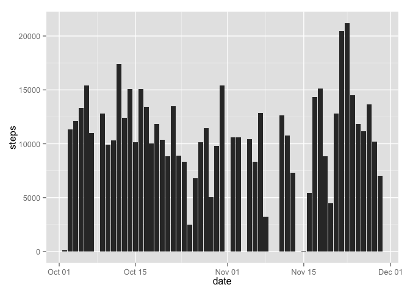
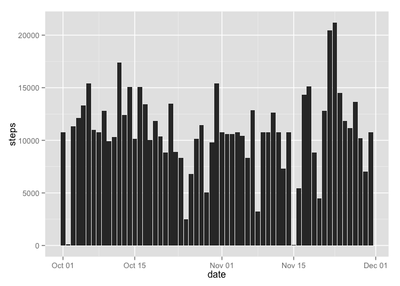

# PA1_template.Rmd
Bhaskar  
August 14, 2014  

This report outlines the process followed in order to answer the questions below.  
The data analyzed is contained in the activity.csv file  

##1) Loading and Pre-processing - (Loading the file, converting to date format)  


```r
## Read the data
dact <- read.table("./activity.csv",header=TRUE, sep=",")
## Convert into date format
dact$date <- as.Date(dact$date,"%Y-%m-%d")
```
  
##2) Answering question - What is mean total number of steps taken per day?  
First plot a histogram of the total steps taken per day  

```r
## Remove the NAs
dact <- na.omit(dact)
library(ggplot2)
## First calculate the sum per day
sumaggr <- aggregate(steps ~ date,data = dact,sum)
## Plot histogram of total steps by day
ggplot(data=sumaggr, aes(x=date, y=steps)) + geom_bar(stat="identity")
```

 
    
Now we will calculate the Mean and Median per day  

```r
## Calculating the Mean and Median per day
mean(sumaggr$steps)
```

```
## [1] 10766
```

```r
median(sumaggr$steps)
```

```
## [1] 10765
```
  
Mean is 10766.19 and Median is 10765  
  
##3) Answering Question - What is the average daily activity pattern?  
Below plot shows the average number of steps for each time perios (5 minute increment). That gives us an idea of the activity pattern  

```r
daggr <- aggregate(steps ~ interval,data = dact,mean)
plot(steps ~ interval, daggr,type="l")
## Calculate mean for all the dates
mx = mean(daggr$steps)
## Draw a line showing the mean
abline(h = mx, col = "blue", lwd = 2)
```

 
  
The time period 835 has the maximum activity, as shown by the below command.  

```r
daggr[daggr$steps == max(daggr$steps),]
```

```
##     interval steps
## 104      835 206.2
```
  
##4) Imputing Missing Values  

###4.1 - Total number of missing rows can be found by below command. First we will read the data again  

```r
## Read the data
dact <- read.table("./activity.csv",header=TRUE, sep=",")
## Convert into date format
dact$date <- as.Date(dact$date,"%Y-%m-%d")
```
  
The following command will show that there are 2304 NAs in the dataset  

```r
nrow(dact) - nrow(na.omit(dact))
```

```
## [1] 2304
```
  
###4.2 Since there are so many NAs, my strategy is to use the mean of that interval across all the days to substitute for the NA  
  
###4.3 Implementing above strategy  

```r
## first join based on the mean for each interval
dnew <- merge(dact, daggr, by='interval')
## then select the mean for the NA records
dtmp1 <- dnew[is.na(dnew$steps.x),c(1,3,4)]
## select the actual values for the proper records
dtmp2 <- dnew[!is.na(dnew$steps.x),c(1,3,2)]
## sync the col names else rbind does not work
names(dtmp1) <- c("interval","date","steps")
names(dtmp2) <- c("interval","date","steps")
## Use rbind to merge both data frames
dnew1 <- rbind(dtmp1,dtmp2)
## Change order of columns to make the original and new data frame same
dnew1 <- dnew1[,c(3,2,1)]
```
  
dnew1 is a new data frame that is similar to the original data frame with the missing values filled in with the mean of the intervals.  
  
###4.4  
Now lets re-make the histogram we did previously with the new dataframe(dnew1) instead of the original one(dact)  

```r
## First calculate the sum per day
sumaggr1 <- aggregate(steps ~ date,data = dnew1,sum)
## Plot histogram of total steps by day
ggplot(data=sumaggr1, aes(x=date, y=steps)) + geom_bar(stat="identity")
```

 
  
The main difference is that the days where there were very few data has now been replaced with the mean values. Overall the chart is very similar.  
  
Now we can calculate the Mean and Median per day  

```r
## Calculating the Mean and Median per day
mean(sumaggr1$steps)
```

```
## [1] 10766
```

```r
median(sumaggr1$steps)
```

```
## [1] 10766
```
  
Mean is 10766.19 and Median is 10766.19. By substituting the NAs with the mean value, the mean has not been impacted, but the median has now become equal to the mean  
  
##5. Answering the question - Are there differences in activity patterns between weekdays and weekends?
###5.1 Adding a factor variable for weekday  

```r
dnew1$factor <- sapply(dnew1$date, function(x) {
  if (weekdays(x) %in% c("Sunday","Saturday"))
    "weekend"
  else
    "weekday"
})

dnew1$factor <- as.factor(dnew1$factor)
```
  
###5.2 Making Panel Plot using lattice  

```r
## Calculate Means for weekdays for each interval
daggrewd <- aggregate(steps ~ interval,data = dnew1[dnew1$factor == "weekday",],mean)
## Calculate Means for weekends for each interval
daggrewe <- aggregate(steps ~ interval,data = dnew1[dnew1$factor == "weekend",],mean)
daggrewd$fact <- "weekday"
daggrewe$fact <- "weekend"
dcombo <- rbind(daggrewd,daggrewe)
library(lattice)
xyplot(steps ~ interval|fact, dcombo, type = "l", layout = c(1,2))
```

 
  
